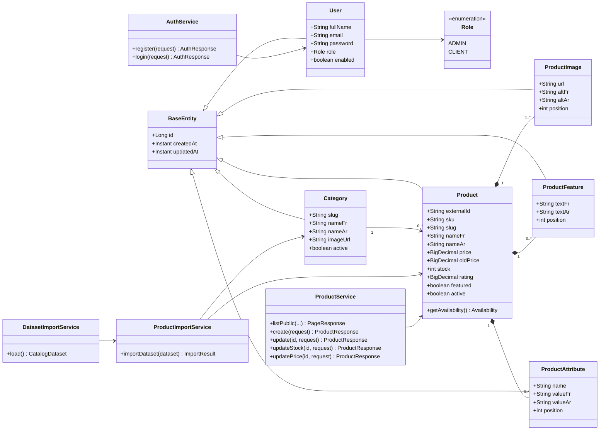

# Diagramme de classes HOLAKIDS

Le mot de passe de `User` contient un hash BCrypt. Le JWT n'est pas persisté : il est signé par le backend et envoyé par le client dans `Authorization: Bearer <token>`.
