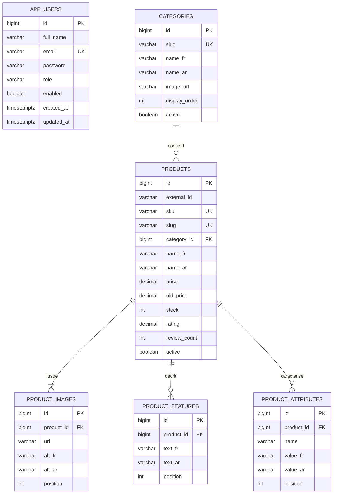

# Schéma PostgreSQL



Hibernate crée et met à jour ce schéma avec `spring.jpa.hibernate.ddl-auto=update`. Pour repartir sur un catalogue propre de 460 produits :

`external_id` est facultatif. Son unicité, lorsqu'il est renseigné, est contrôlée par le service d'import et le service produit ; `sku` et `slug` restent les clés uniques obligatoires en base.

```bash
docker compose down -v
docker compose up --build
```
